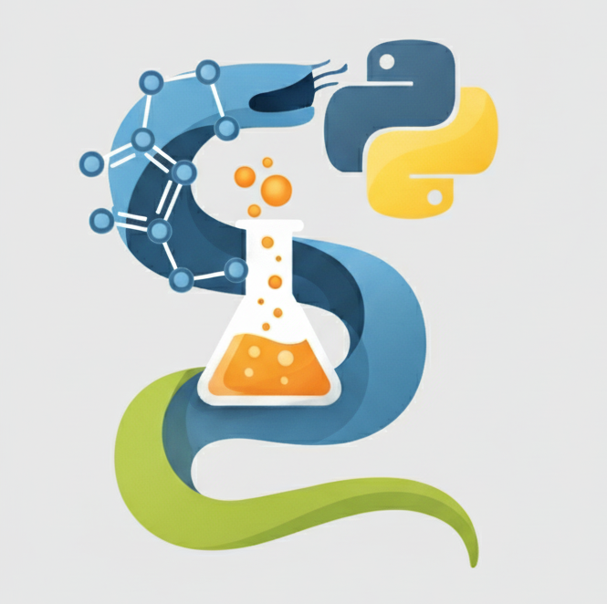

# 2025-2026 Programming for Chemistry @ UniMI
This repository contains the slides and the Jupyter notebook for the classes.

You can find the calendar of the lectures, info and last-minute announcements
[here](https://dceresoli.github.io/2025-Programming).

